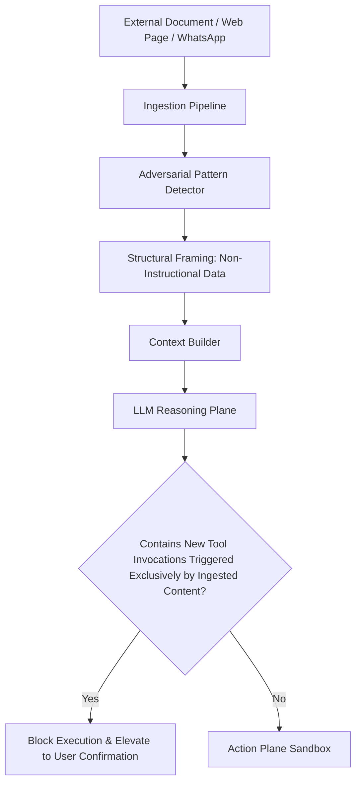

# Threat Model: JARVIS Autonomous AI Operating System

**Document Version:** 1.0.0  
**Classification:** Internal Security Architecture  
**Methodology:** STRIDE (Spoofing, Tampering, Repudiation, Information Disclosure, Denial of Service, Elevation of Privilege)

---

## 1. Executive Summary & Security Philosophy

JARVIS is an autonomous executive AI operating system capable of cross-device orchestration, desktop process manipulation, browser interaction, and direct tool execution. Unlike conventional conversational bots, JARVIS holds write and execution permissions across filesystems, calendar APIs, mobile devices, and system shells.

**Primary Security Principles:**
1. **Zero-Trust for Model Context:** LLM is a reasoning engine, NOT an authorized executive. The LLM never touches credentials, master encryption keys, or unredacted PII.
2. **Untrusted Data Marking:** External content (web pages, ingested documents, emails, WhatsApp messages, Android notifications) is strictly marked as **NON-INSTRUCTIONAL DATA**. Prompt injection through data ingestion is the #1 adversarial threat.
3. **Four-Plane Isolation:** Reasoning, Action, Credentials, and Session states operate on segregated planes with verifiable boundaries.
4. **Append-Only Cryptographic Audit Trail:** Every policy decision, secret retrieval, and tool invocation is hashed into an immutable SHA-256 blockchain-style hash chain.

---

## 2. STRIDE Threat Analysis

| Threat Category | Specific Attack Vector | Target Surface | Mitigation & Defense-in-Depth |
| :--- | :--- | :--- | :--- |
| **Spoofing** | Forged WhatsApp webhook messages | `integrations/whatsapp` | Mandatory HMAC SHA-256 signature verification using secret app key; strict number allowlist. |
| **Spoofing** | Rogue desktop agent IPC connection | `apps/windows-agent` | Mutual TLS (mTLS) with self-signed root cert generated at install + single-use pairing tokens; loopback-only bind (`127.0.0.1`). |
| **Spoofing** | Ambient voice impersonation | Android Wake Word | On-device wake-word detection + speaker profile verification + BiometricPrompt elevation for HIGH/CRITICAL actions. |
| **Tampering** | Indirect Prompt Injection in ingested papers / portal | ContextBuilder & LLM | Strict structural separation: `<<UNTRUSTED_CONTENT>>` tags with anti-instruction sandboxing; heuristic injection scanners; human confirmation elevation for external triggers. |
| **Tampering** | Local file system manipulation / path traversal | `tools/read_file`, `tools/write_file` | Strict canonical path resolution against filesystem allowlist; rejection of symlinks and `..` traversal. Pre-action backup snapshots. |
| **Tampering** | Audit log tampering | `packages/core/security/auditLog.ts` | SHA-256 cryptographic hash chain: any modified, deleted, or inserted log entry breaks downstream hash validation. |
| **Repudiation** | Denying an authorized action was triggered | Orchestrator & Tools | Immutable audit log captures `traceId`, user approval status, timestamp, caller surface, input hash, and output hash. |
| **Information Disclosure** | LLM leaking API keys or secrets in logs/chats | LLM output & traces | Real-time `Redactor` pipeline masks tokens, API keys, CPF, credit cards, and passwords before logging or returning to clients. Secrets held as opaque `credential_ref`. |
| **Information Disclosure** | Browser session hijacking / cookie leakage | `packages/browser` | Cookies and storage states stored AES-256-GCM encrypted in the Vault; never exposed to LLM context or logs. |
| **Denial of Service** | Infinite tool looping / token budget exhaustion | Planner & Executor | Hard limits: Max 15 steps per cycle, per-tool circuit breakers (trip on 3 consecutive failures), token quotas, and execution timeouts (default 30s). |
| **Denial of Service** | Webhook flooding / DoS | Public endpoints | In-memory token bucket rate limiting (10 req/sec per IP) + strict payload size caps. |
| **Elevation of Privilege** | LLM executing CRITICAL action autonomously | PolicyEngine | Hard architectural gate: actions with `CRITICAL` or `ALTO` risk level require explicit out-of-band user confirmation. Autonomous elevation is mathematically barred. |
| **Elevation of Privilege** | Shell command injection on Windows/Linux host | `tools/run_command` | Strict command array execution (no `sh -c` string interpolation); strict binary allowlist (`git`, `ls`, `npm`); execution under low-privilege service account. |

---

## 3. Threat Matrix & Risk Mitigation Levels

```
+-------------------+---------------------------------------------------------+
| Risk Level        | Execution Rule & Guardrail                              |
+-------------------+---------------------------------------------------------+
| BAIXO (Low)       | Autonomous execution allowed (read-only, telemetries)   |
| MÉDIO (Medium)    | Configurable: Auto or Notify (reversible state changes) |
| ALTO (High)       | Mandatory explicit user confirmation before execution   |
| CRÍTICO (Critical)| Out-of-band MFA confirmation + cryptographic seal       |
+-------------------+---------------------------------------------------------+
```

---

## 4. Prompt Injection Defense Architecture



---

## 5. Panic Kill Switch Protocol

When triggered (`/api/security/kill-switch` or physical UI button):
1. Immediately suspends all background queues, scheduled syncs, and browser contexts.
2. Revokes active session tokens and freezes the Vault.
3. Sets system state to `EMERGENCY_LOCKDOWN`.
4. Emits persistent visual alert to all connected surfaces.
